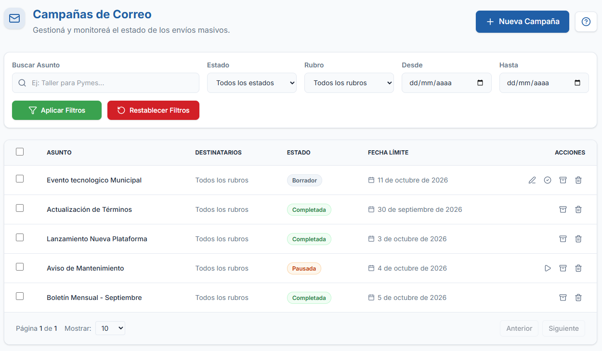
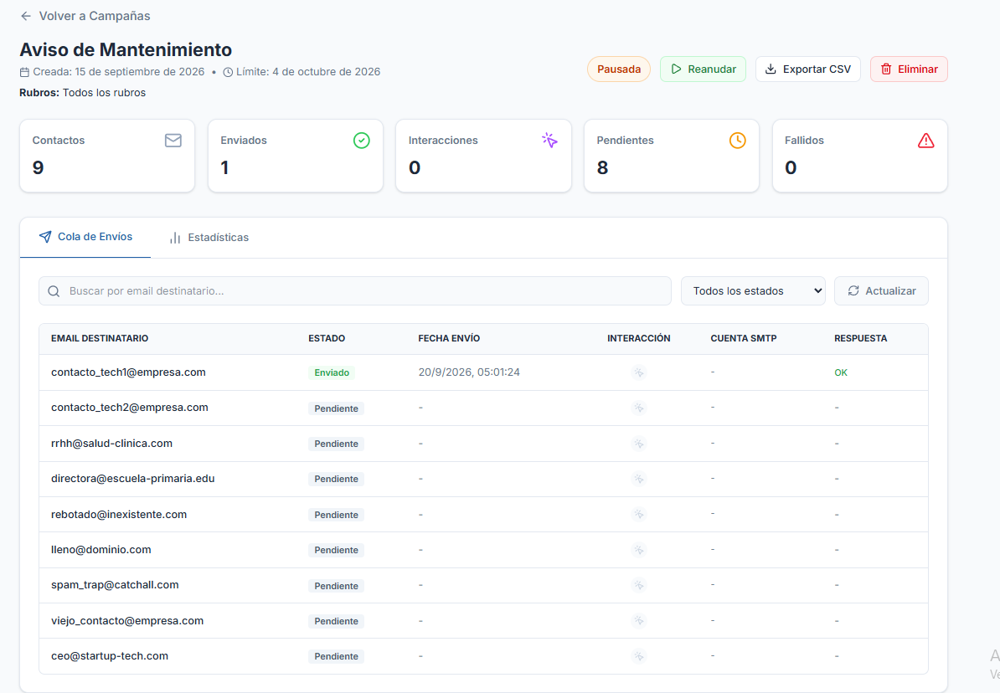
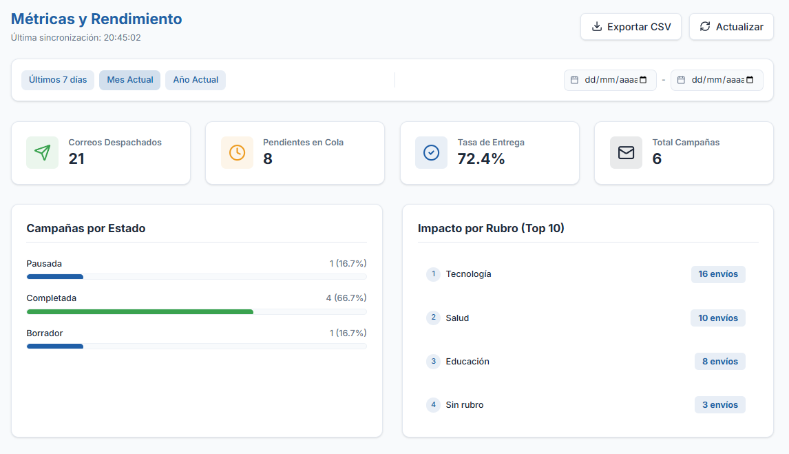
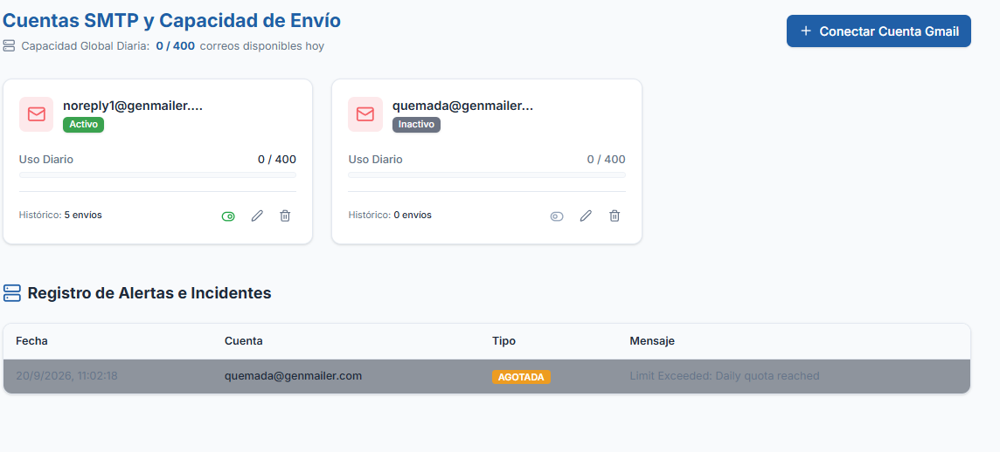
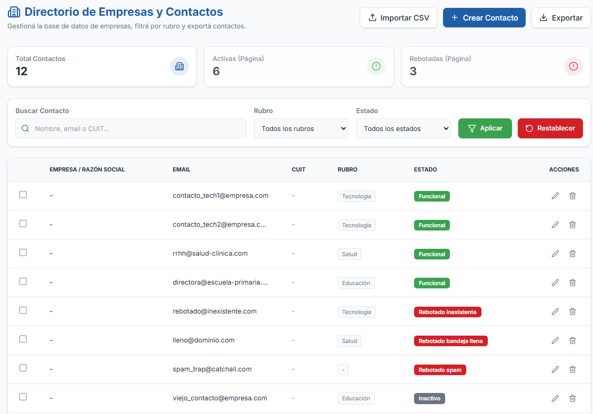

# 📧 Plataforma de Mailing y Gestión de Campañas



Una plataforma integral para el envío masivo de correos electrónicos, gestión de contactos y análisis estadístico, diseñada con un enfoque en la escalabilidad, la experiencia de usuario y el manejo eficiente de límites de servidores SMTP.

## 📖 Historia del Proyecto

Este proyecto nació como una solución a medida para la **Municipalidad de Tres de Febrero**. En su origen, el sistema fue desarrollado mano a mano con las encargadas del área de comunicación. A través de un proceso iterativo de escucha activa, fui adaptando la plataforma a sus necesidades reales del día a día: desde la creación intuitiva de plantillas HTML hasta la necesidad crítica de sortear los límites estrictos de envío diario de los servidores de correo (como el límite de 400 correos por día de Gmail).

Esta versión (GenMailer) es una **adaptación genérica y mejorada** de ese software en producción. Se han eliminado datos sensibles y lógicas exclusivas del municipio, transformándolo en un producto SaaS marca blanca, ideal para demostrar su arquitectura técnica y fluidez.

---

## 🚀 Características Principales

- **Gestor Inteligente de Colas SMTP (Round Robin):** Rotación automática y balanceo de carga entre múltiples cuentas SMTP. Si una cuenta agota su límite de envíos diarios, el sistema salta automáticamente a la siguiente cuenta disponible sin interrumpir la campaña.
- **Procesamiento Asíncrono (Workers & Redis):** Tareas en segundo plano (Cron Jobs) que manejan el despacho progresivo de correos y la lectura de bandejas IMAP para detectar rebotes. Se apoyan en colas de alto rendimiento para garantizar que ningún correo se pierda.
- **Dashboard Estadístico y Exportación:** Gráficos interactivos de altas y bajas, tasas de entrega, y estadísticas por rubro, impulsados por consultas SQL optimizadas, con capacidad de exportar métricas.
- **Autenticación y Permisos (RBAC):** Acceso asegurado mediante **JWT (JSON Web Tokens)** con control de acceso basado en roles. La interfaz y las operaciones permitidas mutan según si el usuario es "desarrollador", "encargado" o "invitado".
- **Gestor de Contactos y Rubros:** Importación/Exportación masiva de bases de datos mediante CSV o Excel, validaciones estrictas (impulsadas por esquemas) y categorización dinámica, filtrando automáticamente los correos rebotados.
- **Seguridad y Trazabilidad:** Las credenciales SMTP se cifran nativamente con **AES-256-GCM**. Todo el sistema cuenta con **Logs estructurados** (alertas de errores, monitoreo de cuentas quemadas) y scripts de **Backups** automatizados para resguardar la base de datos.
- **Sistema Integrado de Soporte:** Módulo de ticketing (Soporte) donde los usuarios regulares pueden reportar errores o enviar sugerencias directamente al rol desarrollador.


---

## 🛠️ Stack Tecnológico

Este proyecto demuestra un dominio completo **Full-Stack** sobre arquitecturas modernas:

### Backend
- **Node.js & Express con TypeScript:** API RESTful robusta, fuertemente tipada y modular.
- **PostgreSQL & Redis:** Base de datos relacional para la persistencia transaccional (con consultas complejas, JOINs y agrupaciones para reportes), combinada con Redis para el manejo rápido de caché y estados efímeros.
- **Zod:** Validación estricta de esquemas de datos (schemas) tanto en el ingreso (API) como en el procesamiento.
- **Nodemailer & node-imap:** Protocolos de bajo nivel para el envío de correos y lectura de bandejas de entrada.
- **node-cron & Winston:** Implementación de Workers para procesamiento en segundo plano, sumado a un sistema avanzado de logs con rotación diaria (Winston) para el monitoreo y trazabilidad de errores.
- **Criptografía nativa (crypto):** Para el cifrado seguro de contraseñas de terceros.

### Frontend
- **React.js (Vite) + TypeScript:** Arquitectura SPA extremadamente rápida, segura y ligera.
- **TailwindCSS:** Sistema de diseño responsivo y moderno (Glassmorphism, Dark/Light modes sutiles).
- **Zustand:** Manejo del estado global de autenticación de manera limpia y sin boilerplate.
- **Recharts:** Renderizado de gráficos SVG para estadísticas.

### Infraestructura
- **Docker & Docker Compose:** Contenerización de los servicios (Frontend, Backend, Base de Datos) para lograr un entorno reproducible con un solo comando.


---

## ⚙️ Cómo Levantar el Proyecto (Entorno Local)

El proyecto está 100% dockerizado para que su ejecución sea trivial sin importar tu sistema operativo.

### Prerrequisitos
- Tener **Docker** y **Docker Compose** instalados.

### Pasos

1. **Clonar el repositorio:**
   ```bash
   git clone https://github.com/LeonardoMuranodev/mailing-platform-demo.git
   cd mailing-platform-demo
   ```

2. **Configurar variables de entorno:**
   Copia el archivo de ejemplo y revisa sus valores.
   ```bash
   cp .env.example .env
   ```
   *(Las contraseñas maestras y la clave de encriptación ya vienen provistas por defecto en el entorno de desarrollo).*

3. **Levantar los contenedores:**
   ```bash
   docker compose up --build
   ```

4. **Acceder a la Plataforma:**
   - **Frontend:** http://localhost:80
   - La base de datos ejecutará automáticamente las migraciones SQL y un script de **Seeding** poblado con datos de prueba realistas (campañas, contactos, reportes).
   - *Nota: Utiliza las credenciales definidas en tu `.env` para iniciar sesión.*

---

## 📸 Galería de Vistas

Para visualizar la interfaz, revisa las siguientes capturas del sistema en funcionamiento:

| Campañas e Historial | Dashboard Estadístico |
| :---: | :---: |
|  |  |

| Gestión de Cuentas SMTP | Directorio de Contactos |
| :---: | :---: |
|  |  |

| Gestión de Usuarios (RBAC) | Sistema de Soporte |
| :---: | :---: |
|  |  |

---

## 👨‍💻 Autor

**Leonardo Murano**  
Full-Stack Developer  
- [LinkedIn](https://www.linkedin.com/in/leonardo-murano)
- [GitHub](https://github.com/LeonardoMuranodev)
